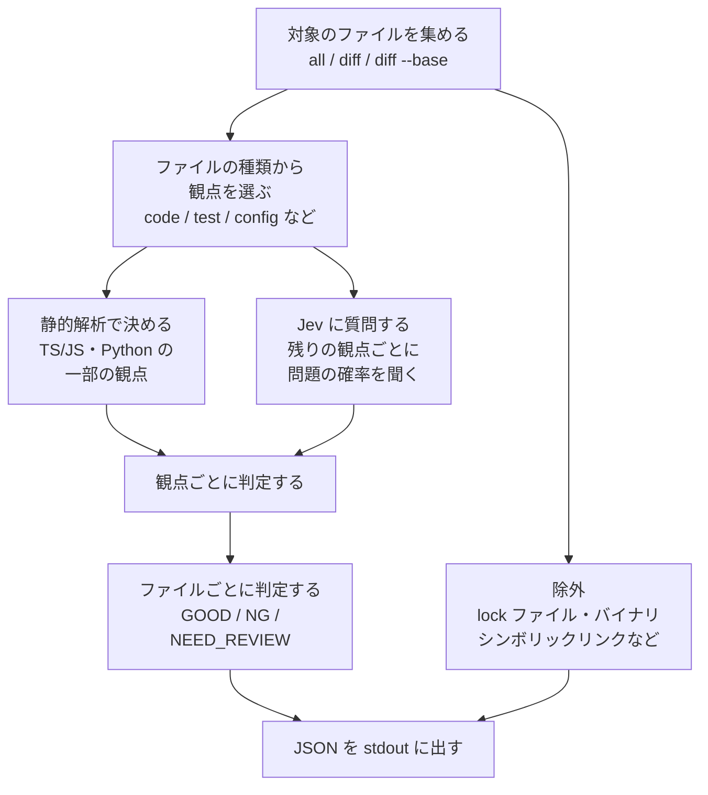

# jeview

[](https://github.com/YuSa0-6/Jeviews/actions/workflows/ci.yml)
[](LICENSE)


リポジトリのファイルを 1 つずつ [Jev](https://docs.typesafe.ai) に見てもらい、「先に読むべきファイル」を JSON で返すコードレビュー CLI です。

- プロジェクト名は Jeviews、コマンドと npm パッケージの名前は `jeview` です
- 個人が開発している非公式のツールです（TypeSafe AI の製品とは別のものです）
- 実験段階です。コマンドや出力の形は予告なく変わることがあります

## 概要

大きなリポジトリや PR を前にして「どこから読むか」を決めるための道具です。ファイルごとに `GOOD` / `NG` / `NEED_REVIEW` の判定を付け、判定の根拠になった確率も JSON に残します。

### 仕組み



Jev は TypeSafe AI の評価用モデルです。テキストと yes/no の質問を渡すと、「はい」である確率を返します。jeview は観点ごとに 2 つの質問をします。

| 質問 | JSON での名前 |
|---|---|
| このファイルに問題はあるか | `problem.probability` |
| 判断するのに、ほかのファイルも見る必要があるか | `needsContext.probability` |

### 出力の例

進捗は stderr に、結果の JSON は stdout に出ます。

```console
$ jeview diff --base origin/main > result.json
jeview diff: 3 files, 1 excluded, snapshot 9c1f0e4b7a2d8e6f5c3b1a0d9e8f7c6b5a4d3e2f, base origin/main (a69b2d9c1f2e)
[1/3] README.md (4096 bytes, doc)
[2/3] src/config.ts (2310 bytes, code)
[3/3] src/server.ts (8123 bytes, code)
jeview: status=completed {"GOOD":2,"NG":1} requests=9 inputTokens=23184 costUsd=0.00097373
```

`result.json` の `files[]` には、ファイル 1 つにつき 1 つの要素が入ります（下の例は一部の項目を省いています）。

```json
{
  "path": "src/server.ts",
  "kind": "code",
  "verdict": "NG",
  "checks": [
    {
      "group": "error_handling",
      "checkId": "error_empty_catch",
      "problem": { "probability": 0.81 },
      "needsContext": { "probability": 0.12 },
      "verdict": "NG"
    },
    {
      "group": "lint",
      "checkId": "lint_unused_import",
      "problem": null,
      "needsContext": null,
      "verdict": "NG",
      "evidence": { "source": "typescript", "detail": "TS6133 readFile L3" }
    }
  ]
}
```

## クイックスタート

### 用意するもの

| もの | 備考 |
|---|---|
| Node.js 22 以上 | |
| pnpm | `npm install -g pnpm` で入ります |
| Git | 見たいリポジトリが Git で管理されていること |
| API キー 1 つ | TypeSafe / Vercel AI Gateway / OpenRouter / Cloudflare のどれか（[接続先と API キー](#接続先と-api-キー)） |
| jq（任意） | 結果の JSON を絞り込むときに使います |

### 1. インストールする

npm への公開は準備中です。いまは clone してビルドします。

```sh
git clone https://github.com/YuSa0-6/Jeviews.git ~/Jeviews
cd ~/Jeviews
pnpm install
pnpm run build
```

alias を設定すると、どのディレクトリからでも `jeview` で呼べます。以降の例は `jeview` と書きます。

```sh
alias jeview="node $HOME/Jeviews/dist/cli.js"   # ~/.bashrc や ~/.zshrc に書くと次回以降も使えます
```

### 2. API キーを置く

見たいリポジトリの直下に `.env.local` を作り、キーを 1 行書きます。`.env.local` がそのリポジトリの `.gitignore` に入っていることも確かめてください。

```dotenv
TYPESAFE_API_KEY=ここにキーを書く
```

### 3. 実行する

見たいリポジトリの直下で実行します。

```sh
cd ~/work/your-repo
jeview all > result.json
```

`NG` のファイルは次のコマンドで一覧できます。

```sh
jq -r '.files[] | select(.verdict == "NG") | .path' result.json
```

### npm 公開後の使いかた（準備中）

| 経路 | コマンド | 向いている場面 |
|---|---|---|
| repo に固定する | `pnpm add -D jeview` のあと `pnpm jeview all > result.json` | チーム・Git hook・CI。全員が同じ版で判定できます |
| その場で試す | `npx jeview all > result.json` | install せずに 1 回だけ試す |

## 使いかた

見たいリポジトリの直下で、`jeview [対象] [オプション]` の形で実行します。

### 対象

| 対象 | 見るファイル | 向いている場面 |
|---|---|---|
| `all` | Git で追跡しているファイルすべて | リポジトリ全体から、先に読むファイルを決める |
| `diff`（省略時） | まだ `git add` していない変更があるファイル（`git diff` に出るもの） | commit の前に、自分の変更を確かめる |
| `diff --base <ref>` | HEAD が `<ref>` から分かれた後に変わったファイル。commit 済みの変更と手元の変更の両方を含む | PR を確かめる |

対象を省略すると `diff` を実行します。

```sh
jeview > result.json                      # jeview diff と同じ
jeview --base origin/main > result.json   # jeview diff --base origin/main と同じ
```

- どの対象でも、選んだファイルの全体を送り、ファイルごとに判定します
- 実行したディレクトリの配下が対象です。`.env.local` も実行したディレクトリから読みます
- 新しく作ったファイルを `diff` で見るには、先に `git add -N <ファイル>` で Git に知らせます
- `diff` で消したファイルは、結果の `exclusions` に `"reason": "deleted"` で残ります

### PR の差分を見る

`diff --base <ref>` は、HEAD が `<ref>` から分かれた地点（merge base）と作業ツリーを比べます。GitHub の PR の「Files changed」と同じ範囲に、まだ commit していない手元の変更が加わります。

| 場面 | 手順 |
|---|---|
| 上がっている PR を手元で見る | `gh pr checkout 123`（GitHub CLI）で PR のブランチに切り替え、`git fetch origin` のあと `jeview diff --base origin/main` |
| GitHub Actions で PR ごとに見る | `pull_request` をきっかけにし、`actions/checkout` に `fetch-depth: 0` を付けて `jeview diff --base origin/${{ github.base_ref }}` |
| commit していない変更をまとめて見る | `jeview diff --base HEAD`（`git add` 済みの変更も含む） |

- 分かれた地点を求めるために base の履歴を使います。shallow clone では `fetch-depth: 0` などで履歴を取ってください
- GitHub Actions では `pull_request` を使います。fork からの PR には Secrets が渡らないので、API キーが守られます（`pull_request_target` は fork のコードに Secrets を渡すため避けます）
- 比べた起点は、結果の `run.base` に `{ "ref": "origin/main", "mergeBase": "<コミット>" }` の形で残ります

### オプション

| オプション | 既定 | 用途 |
|---|---|---|
| `--base <ref>` | — | `diff` で比べる起点を、HEAD が `<ref>` から分かれた地点にする |
| `--provider <名前>` | キーがある接続先 | `typesafe` / `vercel-gateway` / `openrouter` / `cloudflare` から選ぶ。`cloudflare` は指定したときだけ使う |
| `--model <名前>` | 接続先ごとの既定 | モデルを変える。OpenRouter で版を固定するなら `typesafe/jev-1.13` |
| `--max-state-bytes <n>` | `60000` | これより大きいファイルは送らずに `NEED_REVIEW` にする |
| `--concurrency <n>` | `4` | 同時に処理するファイル数（同時に送るリクエスト数） |

### 終了コード

| 終了コード | 意味 |
|---|---|
| 0 | 全ファイルの判定が終わった（`NG` があっても 0） |
| 1 | 途中で失敗した、または一部のファイルを判定できなかった |

CI で `NG` があるときに止めたい場合は、jq で数えます。

```sh
jq -e '[.files[] | select(.verdict == "NG")] | length == 0' result.json
```

### 接続先と API キー

| 接続先 | 環境変数 | 既定のモデル | 自動で選ぶ順 |
|---|---|---|---|
| TypeSafe 直結 | `TYPESAFE_API_KEY` | `jev-latest` | 1 |
| Vercel AI Gateway | `AI_GATEWAY_API_KEY` | `typesafe-ai/jev` | 2 |
| OpenRouter | `OPENROUTER_API_KEY` | `~typesafe/jev-latest` | 3 |
| Cloudflare | `CLOUDFLARE_API_TOKEN` と `CLOUDFLARE_ACCOUNT_ID` | `typesafe/jev` | `--provider cloudflare` を付けたときだけ使う |

キーが複数あるときは、「自動で選ぶ順」で最初に見つかった接続先を使います。`--provider` で選ぶこともできます。

Cloudflare を指名制にしているのは、`CLOUDFLARE_API_TOKEN` が wrangler でのデプロイなど、AI 以外の用途でもよく設定されているためです。指名したときだけ、Cloudflare にコードを送ります。

| キーの渡し方 | 書く場所 | 向いている場面 |
|---|---|---|
| `.env.local` | 見たいリポジトリの直下。`.gitignore` に入れる | 手元で繰り返し使う |
| 環境変数 | シェルで `export TYPESAFE_API_KEY=...` | 手元で 1 回試す |
| CI の Secrets | GitHub Actions なら `env:` に `${{ secrets.TYPESAFE_API_KEY }}` | CI |

- `jeview` は実行したディレクトリの `.env.local` と `.env` をこの順で読みます。シェルで設定済みの値が優先されます
- 接続先の URL は `TYPESAFE_BASE_URL` / `AI_GATEWAY_BASE_URL` / `OPENROUTER_BASE_URL`（末尾は `/v1`）/ `CLOUDFLARE_BASE_URL` で変えられます。書きかたは [.env.example](.env.example) にあります

## 結果の読みかた

結果は 1 つの JSON です。

| 場所 | 中身 |
|---|---|
| `run` | 実行の情報（対象、接続先、モデル、状態、閾値、使った量） |
| `files[]` | ファイル 1 つにつき 1 要素。`verdict` がファイルの判定 |
| `files[].checks[]` | 観点ごとの確率と判定 |
| `exclusions[]` | 対象から外したファイルと理由 |

### ファイルの判定

まず `files[].verdict` を見ます。

| verdict | 意味 | 次にすること |
|---|---|---|
| `NG` | どれかの観点で、問題がある確率が高い | 先に読む |
| `NEED_REVIEW` | そのファイルだけでは判断できない、または大きすぎて送っていない | 周りのファイルと合わせて人が読む |
| `GOOD` | どの観点でも問題は見つからなかった | 後回しにしてよい |
| `null` | API エラーなどで判定できなかった | `error` を確かめて再実行する |

### 観点ごとの結果

`files[].checks[]` には、観点ごとの結果が入ります。

| 項目 | 意味 |
|---|---|
| `checkId` | 観点の名前（[見ている観点](#見ている観点)） |
| `problem.probability` | 問題がある確率 |
| `needsContext.probability` | ほかのファイルも見ないと判断できない確率 |
| `verdict` / `reason` | 観点ごとの判定と、その理由 |
| `evidence` | 静的解析で決めたときの根拠。`detail` に行番号などが入る |

| reason | 意味 |
|---|---|
| `needs_context` | ほかのファイルも見ないと判断できない |
| `input_too_large` | 大きすぎて送っていない |
| `uncertain` | 確率が `NG` と `GOOD` の間。観点の結果に残し、ファイルの判定には上げない |
| `not_applicable` | このファイルの種類には当てない観点。質問していない |
| `api_error` | 問い合わせに失敗した |

### 判定の決まりかた

観点ごとの判定は、上の行から順に当てはめて決めます。

| 順 | 条件 | 観点の判定 |
|---|---|---|
| 1 | `problem.probability` が NG の閾値以上 | `NG` |
| 2 | `needsContext.probability` が 0.65 以上 | `NEED_REVIEW`（`needs_context`） |
| 3 | `problem.probability` が 0.35 より大きい | `NEED_REVIEW`（`uncertain`） |
| 4 | それ以外 | `GOOD` |

ファイルの判定も、観点の判定から上の行の順に決めます。

| 順 | 条件 | ファイルの判定 |
|---|---|---|
| 1 | `NG` の観点が 1 つでもある | `NG` |
| 2 | `needs_context` か `input_too_large` の観点がある | `NEED_REVIEW` |
| 3 | 判定できなかった観点がある | `null` |
| 4 | それ以外（`uncertain` の観点は `GOOD` の側に数える） | `GOOD` |

NG の閾値は、観点ごと・言語ごとに評価して決めています。実際の値は `run.thresholds` に出ます。確率は JSON に残るので、あとから閾値を変えて読み直せます。

### run のおもな項目

| 項目 | 中身 |
|---|---|
| `status` | `completed`（全ファイル判定済み）/ `partial`（一部のファイルを判定できなかった）/ `failed`（途中で失敗した） |
| `scope` / `base` | 対象と、`--base` で比べた起点 |
| `provider` / `model` | 使った接続先とモデル |
| `usage` | リクエスト数、トークン数、費用（USD） |
| `snapshotId` | 実行したときの HEAD。commit していない変更があれば末尾に `+dirty` が付く |
| `policyHash` | 質問・閾値・モデル・静的解析の道具の版から作った値。同じ値なら同じ基準で判定している |
| `fatalError` | `failed` になった理由 |

### よく使う jq

```sh
# NG の観点を一覧する（ファイル / 観点 / 確率、または静的解析の根拠）
jq -r '.files[] | select(.verdict == "NG") | .path as $p | .checks[] | select(.verdict == "NG") | [$p, .checkId, (.problem.probability // .evidence.detail)] | @tsv' result.json

# NEED_REVIEW の理由を一覧する
jq -r '.files[] | select(.verdict == "NEED_REVIEW") | .path as $p | .checks[] | select(.reason == "needs_context" or .reason == "input_too_large") | [$p, .checkId, .reason] | @tsv' result.json

# 判定できなかったファイルを一覧する
jq -r '.files[] | select(.error) | [.path, .error.code, .error.message] | @tsv' result.json
```

## 見ている観点

観点（`group`）ごとに、いくつかの確認項目（`checkId`）に分けて質問します。

| 観点 | checkId | 探すもの |
|---|---|---|
| input_validation | `input_unchecked_use` | 外から読んだ値（コマンドライン引数・環境変数・通信の応答・ファイル）を、形を確かめずに数値・URL・パス・決まった選択肢として使っている |
| input_validation | `input_missing_unhandled` | 外から読んだ値が無い・空のときも、あるものとして使い続けている |
| error_handling | `error_empty_catch` | catch などでエラーを受け取り、記録も再送出も失敗の返却もせずに捨てている |
| error_handling | `error_success_after_failure` | 処理が失敗したあとに、成功として返す・続ける |
| error_handling | `error_unhandled_promise` | Promise などの非同期処理の失敗を、await も処理もしていない |
| secret_exposure | `secret_hardcoded` | API キー・パスワード・トークン・秘密鍵の値がそのまま書いてある |
| secret_exposure | `secret_logged` | 秘密の値をログ・標準出力・エラーメッセージに出している |
| formatting | `format_indentation` | タブとスペース、またはインデント幅が混ざっている |
| formatting | `format_quotes` | 文字列のシングル / ダブルクォートの使い分けに決まりがない |
| formatting | `format_spacing` | 演算子・カンマ・括弧まわりの空白がそろっていない |
| lint | `lint_unused_import` | 使っていない import |
| lint | `lint_unused_variable` | 使っていない変数 |
| lint | `lint_unused_param` | 使っていない引数 |
| lint | `lint_unreachable` | return や throw のあとなど、実行されないコード |
| lint | `lint_duplicate_condition` | if / else や switch で同じ条件が重なり、あとの分岐に届かない |
| lint | `lint_constant_condition` | いつも true、またはいつも false になる条件 |
| complexity | `complexity_branchy_function` | 分岐（if・ループ・case・catch・三項演算子・論理演算子）が 15 以上ある関数 |

### ファイルの種類と当てる観点

ファイルの種類（`kind`）は、拡張子とファイル名から決めます。

| kind | 例 | 当てる観点 |
|---|---|---|
| `code` | `.ts` `.js` `.py` `.rb` `.go` `.rs` `.java` など | すべての観点 |
| `test` | `*.test.ts`、`*_spec.rb`、`test_*.py`、`test/` や `spec/` の中 | formatting、secret_exposure |
| `config` | `.json` `.yaml` `.toml`、`Dockerfile`、`.env` など | formatting、secret_exposure |
| `template` | `.env.example`、`*.sample`、`*.template` | formatting |
| `doc` | `.md` `.txt` など | secret_exposure |
| `other` | 上のどれにも当たらないもの | secret_exposure |

雛形（`template`）は整形だけを見ます。空の値と本物の鍵を Jev が区別しにくいためです。

### 静的解析で決める観点

TypeScript / JavaScript と Python のファイルでは、一部の観点を Jev に聞く前に道具で決めます。道具で決めた観点は、`evidence.source` に道具の名前が入ります。

| ファイル | 道具 | 決める観点 |
|---|---|---|
| TypeScript / JavaScript | tsc（同梱） | `lint_unused_import` / `lint_unused_variable` / `lint_unused_param` |
| TypeScript / JavaScript | fallow（同梱） | `complexity_branchy_function`。いちばん分岐の多い関数の複雑度が 8 以下なら `GOOD`、15 以上なら `NG`。その間は Jev に聞きます |
| Python | 手元の python3 | `lint_unused_param` |

道具が動かないとき（python3 が無い、構文エラーがあるなど）は、その観点も Jev に聞きます。

### 対象から外すファイル

Jev に送らなかったファイルは、`exclusions[]` に理由付きで残ります。

| reason | 対象 |
|---|---|
| `lock_file` | `pnpm-lock.yaml` `package-lock.json` `yarn.lock` `bun.lockb` `Cargo.lock` `poetry.lock` `go.sum` |
| `binary` | 先頭 8 KB に NUL バイトを含むファイル |
| `symlink` | シンボリックリンク。リンク先は、別に追跡しているファイルか Git の外の中身なので読みません |
| `outside_repository` | 実際の場所がリポジトリの外にあるファイル（途中のディレクトリがリンクに置き換わっているなど） |
| `deleted` | `diff` で消したファイル |
| `read_failed: …` | 読めなかったファイル。続けて理由が入る |

## AI エージェントから使う

jeview は、Claude Code などの AI エージェントからも使えます。エージェント向けの手順を [`skills/jeview/SKILL.md`](skills/jeview/SKILL.md) にまとめてあります。起動コマンドの決めかた、対象の選びかた、結果の読みかた、報告のしかたが入っています。

| 使うもの | やりかた |
|---|---|
| Claude Code | `SKILL.md` を `.claude/skills/jeview/`（その repo だけ）か `~/.claude/skills/jeview/`（すべての repo）に置く。「この PR を jeview で見て」と頼むか、`/jeview` で呼び出す |
| SKILL.md を読めるほかのエージェント | 同じファイルを、そのエージェントが Skill を読む場所に置く |
| それ以外のエージェントやチャット | 下のブロックを、最初のメッセージとして貼る |

```sh
# 見たいリポジトリの直下で実行する（clone した Jeviews から写す）
mkdir -p .claude/skills/jeview
cp ~/Jeviews/skills/jeview/SKILL.md .claude/skills/jeview/
```

npm 公開後は、`node_modules/jeview/skills/jeview/SKILL.md` からも写せます。インストールした版の CLI と同じ版の手順書になります。

<details>
<summary>エージェントに渡すコンテキスト（<code>skills/jeview/SKILL.md</code> と同じ内容）</summary>

````markdown
---
name: jeview
description: jeview（ファイルごとに問題がありそうかを Jev に聞くコードレビュー CLI）を実行し、結果の JSON から先に読むべきファイルを選んで、コードを読んで確かめてから報告する。リポジトリ全体のレビュー、commit 前の変更の確認、PR の差分の確認を頼まれたとき、または jeview の結果（result.json）を読むときに使う。
---

# jeview でコードを見る

jeview は、Git で管理しているファイルを 1 つずつ Jev（TypeSafe AI の評価モデル）に送り、観点ごとに「問題がある確率」を聞いて、ファイルごとに `GOOD` / `NG` / `NEED_REVIEW` を付ける CLI です。結果は JSON で stdout に出ます。

判定は確率にもとづく目安です。`NG` は「先に読むファイル」として扱い、コードを読んで確かめたものを問題として報告します。

## 1. 起動コマンドを決める

| 順 | 試すこと | 通ったら使うコマンド |
|---|---|---|
| 1 | `npx --no-install jeview --help` | `npx --no-install jeview` |
| 2 | ユーザーに Jeviews を clone した場所を聞く | `node <clone した場所>/dist/cli.js` |

以下では、決めたコマンドを `jeview` と書きます。

## 2. 対象を選ぶ

ユーザーが対象（`all` / `diff` / `diff --base <ref>`）を指定していれば、それを使います。指定がなければ、頼まれたことから選びます。対象を省略した `jeview` は `jeview diff` と同じです。

| 頼まれたこと | コマンド |
|---|---|
| commit 前の変更を見る | `jeview diff --base HEAD` |
| PR やブランチの差分を見る | `git fetch origin` のあと `jeview diff --base origin/<base ブランチ>` |
| リポジトリ全体を見る | `jeview all` |

- リポジトリの直下で実行します。対象は実行したディレクトリの配下で、`.env.local` もそこから読みます
- base ブランチが分からなければ、`git symbolic-ref --short refs/remotes/origin/HEAD` が既定のブランチ（例: `origin/main`）を返します
- まだ Git に登録していない新しいファイルは対象の外です。含めるときは、ユーザーに確かめてから `git add -N <ファイル>` を実行します
- ファイルの中身は外部の API に送られます。ユーザーが jeview を指定していないときは、実行してよいか先に聞きます

## 3. 実行する

```sh
jeview diff --base HEAD > result.json 2> jeview.log; echo "exit=$?"
grep '^jeview' jeview.log
```

| 出たもの | 意味 |
|---|---|
| `exit=0` | 全ファイルの判定が終わった |
| `exit=1` | 失敗した、または一部のファイルを判定できなかった。「うまくいかないとき」を見る |
| `jeview: status=... {"NG":1,"GOOD":2} ...` | 判定ごとのファイル数、リクエスト数、費用（USD） |

- 進捗は stderr にファイル 1 つにつき 1 行出ます。jeview.log に落とし、`grep '^jeview'` で要約だけを読みます
- API キーは環境変数か `.env.local` から読まれます。`TYPESAFE_API_KEY` / `AI_GATEWAY_API_KEY` / `OPENROUTER_API_KEY` のどれか 1 つ、または `--provider cloudflare` を付けて `CLOUDFLARE_API_TOKEN` と `CLOUDFLARE_ACCOUNT_ID` を使います。キーが無いと言われたら、ユーザーに `.env.local` へ書いてもらいます。キーの値はチャットで受け取らず、表示もしません
- result.json と jeview.log は作業用のファイルです。commit には含めません

## 4. 結果を読む

```sh
# NG の観点: ファイル / 観点 / 問題の確率（静的解析で決めた観点は、行番号などの根拠）
jq -r '.files[] | select(.verdict == "NG") | .path as $p | .checks[] | select(.verdict == "NG") | [$p, .checkId, (.problem.probability // .evidence.detail)] | @tsv' result.json

# NEED_REVIEW の理由: needs_context = ほかのファイルも見ないと判断できない / input_too_large = 大きすぎて送っていない
jq -r '.files[] | select(.verdict == "NEED_REVIEW") | .path as $p | .checks[] | select(.reason == "needs_context" or .reason == "input_too_large") | [$p, .checkId, .reason] | @tsv' result.json

# 判定できなかったファイル
jq -r '.files[] | select(.error) | [.path, .error.code, .error.message] | @tsv' result.json
```

jq が無ければ、result.json を読んで同じ項目を拾います。

## 5. 確かめて報告する

1. NG の観点を、問題の確率が高い順に確かめます。ファイルを開き、観点に当てはまる箇所を探します（観点の意味は下の表）
2. Jev はファイル単位で答えるので、場所は自分で探します。`evidence.detail` があれば、そこに行番号が書いてあります
3. 報告は表にします: ファイル / 行 / 観点 / 見つけたこと。見つからなかった観点は「確認できず（誤検知の可能性）」として別の表にします
4. NEED_REVIEW のファイルは、呼び出し元やテストなど周りのファイルと合わせて読みます
5. 修正は、ユーザーが頼んだときに行います

## 観点の意味

| checkId | 探すもの |
|---|---|
| `input_unchecked_use` | 外から読んだ値（コマンドライン引数・環境変数・通信の応答・ファイル）を、形を確かめずに数値・URL・パス・決まった選択肢として使っている |
| `input_missing_unhandled` | 外から読んだ値が無い・空のときも、あるものとして使い続けている |
| `error_empty_catch` | catch などでエラーを受け取り、記録も再送出も失敗の返却もせずに捨てている |
| `error_success_after_failure` | 処理が失敗したあとに、成功として返す・続ける |
| `error_unhandled_promise` | Promise などの非同期処理の失敗を、await も処理もしていない |
| `secret_hardcoded` | API キー・パスワード・トークン・秘密鍵の値がそのまま書いてある |
| `secret_logged` | 秘密の値をログ・標準出力・エラーメッセージに出している |
| `format_indentation` | タブとスペース、またはインデント幅が混ざっている |
| `format_quotes` | 文字列のシングル / ダブルクォートの使い分けに決まりがない |
| `format_spacing` | 演算子・カンマ・括弧まわりの空白がそろっていない |
| `lint_unused_import` | 使っていない import |
| `lint_unused_variable` | 使っていない変数 |
| `lint_unused_param` | 使っていない引数 |
| `lint_unreachable` | return や throw のあとなど、実行されないコード |
| `lint_duplicate_condition` | if / else や switch で同じ条件が重なり、あとの分岐に届かない |
| `lint_constant_condition` | いつも true、またはいつも false になる条件 |
| `complexity_branchy_function` | 分岐（if・ループ・case・catch・三項演算子・論理演算子）が 15 以上ある関数 |

## うまくいかないとき

| 出たもの | 意味 | 次にすること |
|---|---|---|
| `run.fatalError.code` が `config` | キーが無い、またはオプションの書きまちがい | stderr の 1 行目を読んで直す |
| `run.fatalError.code` が `repository` | Git の外で実行した、または `--base` の分岐点が見つからない | `git fetch origin`。shallow clone なら `git fetch --unshallow` |
| `error.code` が `auth` | キーの誤り・権限不足・残高切れ（HTTP 401 / 402 / 403） | ユーザーにキーと残高を確かめてもらう。Cloudflare はトークンの権限（Workers AI の Read）も |
| `error.code` が `rate_limit` | 送る速さの上限（HTTP 429） | `--concurrency 1` を付けて再実行 |
| `error.code` が `bad_request` | ファイルが大きすぎる、またはモデル名のまちがい（HTTP 400 / 404 / 422） | そのファイルは人が読む。`--model` を付けていれば見直す |
| `error.code` が `server` / `network` / `invalid_response` | 接続先の不調、または通信の失敗 | 少し待って再実行 |
````

</details>

## 知っておくと安心なこと

| 項目 | 内容 |
|---|---|
| 送るデータ | ファイルの中身を、選んだ接続先の API にそのまま送ります。外に出してよいリポジトリで使ってください |
| 送るファイル | 実際の場所がリポジトリの中にあるファイルだけを送ります。シンボリックリンクは、リンク先を読まずに除外します |
| 判定の性質 | Jev の確率にもとづく目安です。最終的な判断は人が行う前提で作っています |
| 確率の揺れ | 同じファイルでも、確率は実行ごとに ±0.1 ほど揺れます |
| 費用 | 実際の額は `run.usage.costUsd` に出ます（Vercel AI Gateway は `null`）。目安として、数 KB のファイルなら 1 つあたり 0.001 USD 未満です（TypeSafe 直結） |
| Vercel AI Gateway | 無料枠はレートリミットが厳しめです。大きなリポジトリでは `--concurrency` を下げるか、TypeSafe 直結を使ってください |
| OpenRouter | Jev は alpha 版の Decisions API（`https://openrouter.ai/api/alpha/decisions`）で動きます。API の形が予告なく変わることがあります |
| Cloudflare のトークン | 「Account > Workers AI > Read」の権限が要ります。AI Gateway の権限だけのトークンは HTTP 401 になり、`error.code` は `auth` になります |
| Cloudflare の料金 | アカウントに入れたクレジット（Unified Billing）から引かれます。トークン単価は TypeSafe 直結と同じで、クレジットを買うときに 5% の手数料がかかります（`costUsd` には手数料を含みません） |
| Cloudflare のログ | AI Gateway は、既定でリクエストの本文をログに保存します。jeview は `cf-aig-collect-log-payload: false` を付けて送るので、ログに残るのはトークン数や費用などのメタデータだけです |

## 困ったときは

| 出たもの | 意味 | 次にすること |
|---|---|---|
| `run.fatalError.code` が `config` | キーが無い、またはオプションの書きまちがい | stderr の 1 行目を読んで直す |
| `run.fatalError.code` が `repository` | Git の外で実行した、または `--base` の分岐点が見つからない | `git fetch origin`。shallow clone なら履歴を取る（`fetch-depth: 0` など） |
| `error.code` が `auth` | キーの誤り・権限不足・残高切れ（HTTP 401 / 402 / 403） | キーと残高を確かめる。Cloudflare はトークンの権限も確かめる |
| `error.code` が `rate_limit` | 送る速さの上限（HTTP 429） | `--concurrency` を下げて再実行 |
| `error.code` が `bad_request` | ファイルが大きすぎる、またはモデル名のまちがい（HTTP 400 / 404 / 422） | `--model` を見直す。大きなファイルは人が読む |
| `error.code` が `server` / `network` / `invalid_response` | 接続先の不調、または通信の失敗 | 少し待って再実行 |

解決しないときや不具合を見つけたときは、[GitHub の Issue](https://github.com/YuSa0-6/Jeviews/issues) に書いてください。誤検知や見逃しの報告は、どのファイルのどの観点がどう間違ったかを添えてもらえると助かります。

## 貢献するには

小さな修正や質問だけでも歓迎です。手順は [CONTRIBUTING.md](CONTRIBUTING.md) にあります。参加するすべての人に [行動規範](CODE_OF_CONDUCT.md) が適用されます。

## License

MIT License. Copyright (c) 2026 Yusa (YuSa0-6). 全文は [LICENSE](LICENSE) を参照してください。
